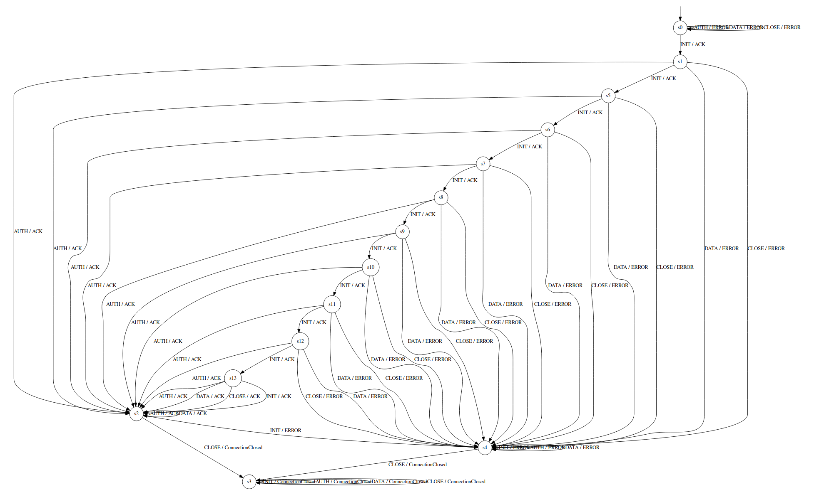

# TTT Algorithm w/ Modified WMethod Equivalence Checking

| **model** | **min depth to find** | **# queries until final hypothesis** |
|:---------:|:---------------------:|:------------------------------------:|
| 1         | 10                    | **147,797** @ depth 10               |
| 2         | 5                     | **96,735** @ depth 5, **213,450** @ depth 6, **577,651** @ depth 7 |
| 3         | 10                    | Give up after 5x10^6  @ depth 10   |

Note that altering the equivalence depth parameters affects both whether we *find* the backdoor states, and if we do, how many queries are required. Overestimating this depth results in signficant increases in queries requires. 

# Greybox Learning with Memory

| **model** | **# queries until termination**  | **# taint tests**|
|:---------:|:--------------------------------:|:-----------------|
| 1         | **139**                          |   13             |
| 2         | **125**                          |   10             |
| 3         | **193**                          |   13             |

# Tested models

1. 10 consecutive INITs from the init state (11 in total) to bypath auth

2. 5 consecutive INITs from the init state, followed by DATA, then 5 more INITs. to bypath auth

3. 10 consecutive INITs from the init state, followed by DATA, then 10 more INITs.

